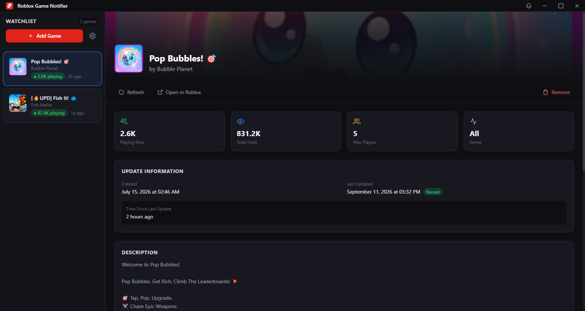

# Roblox Game Notifier

> Track your favorite Roblox games, get notified on updates, and never miss an event.




---

## Features

| Feature | Description |
|---------|-------------|
| **Game Tracking** | Add any Roblox game and monitor it in real-time |
| **Update Notifications** | Get notified instantly when a tracked game gets updated |
| **Upcoming Events** | See all upcoming events with dates, hosts, and status |
| **Event Notifications** | Alert when events start or are about to begin |
| **Notification History** | View all past notifications in one place |
| **Live Stats** | See player count, visits, and game info |
| **Dark Theme** | Sleek Roblox-inspired dark UI |
| **System Tray** | Runs in the background with tray icon |
| **Auto Check** | Configurable check interval (1-60 minutes) |

---

## Download

Download the latest release from [Releases](https://github.com/ysron56/Roblox-Notification/releases/latest)

```
Roblox Game Notifier 1.0.0.exe  (~80MB)
```

### Verify Download

Check the SHA256 hash to verify file integrity:

```
C150B6C7D2F60B1B1ADC40B2CB1ED406C8BBF3D0306E0202BF2A1E7519ABCA2E
```

---

## Quick Start

1. Run `Roblox Game Notifier 1.0.0.exe`
2. Click **+** to add a game (enter Place ID)
3. Enable notifications in **Settings**
4. Done! You'll be notified on updates and events

---

## For Developers

### Prerequisites

- [Node.js](https://nodejs.org/) v18+
- npm

### Setup

```bash
git clone https://github.com/ysron56/Roblox-Notification.git
cd Roblox-Notification
npm install
```

### Development

```bash
npm run dev
```

### Build

```bash
npm run build
```

Output: `release/Roblox Game Notifier 1.0.0.exe`

---

## How It Works

```
┌─────────────────────────────────────────────────┐
│                  Main Process                   │
│  ┌─────────┐  ┌──────────┐  ┌───────────────┐  │
│  │  Fetch   │  │  Check   │  │ Notification  │  │
│  │  Games   │  │  Events  │  │    Handler    │  │
│  └────┬────┘  └────┬─────┘  └───────┬───────┘  │
│       │            │                │           │
│       └────────────┼────────────────┘           │
│                    │                            │
│              ┌─────┴─────┐                      │
│              │  electron- │                      │
│              │   store    │                      │
│              └───────────┘                      │
└─────────────────────┬───────────────────────────┘
                      │ IPC
┌─────────────────────┴───────────────────────────┐
│               Renderer Process                  │
│  ┌──────────┐  ┌──────────┐  ┌───────────────┐  │
│  │ Sidebar  │  │  Game    │  │ Notification  │  │
│  │  List    │  │  Detail  │  │    Panel      │  │
│  └──────────┘  └──────────┘  └───────────────┘  │
└─────────────────────────────────────────────────┘
```

---

## Configuration

| Setting | Default | Description |
|---------|---------|-------------|
| Check Interval | 5 min | How often to check for updates |
| Notifications | ON | Desktop notifications toggle |
| Event Notifications | ON | Event start/reminder alerts |
| Event Reminder | 30 min | Minutes before event to notify |
| Roblox Cookie | - | Required for event fetching |

---

## Tech Stack

- **Frontend:** React, Tailwind CSS
- **Backend:** Electron, Node.js
- **Storage:** electron-store
- **Build:** Vite, electron-builder

---

## License

MIT License - feel free to use and modify

---

<p align="center">
  Made with ❤️ for the Roblox community
</p>
